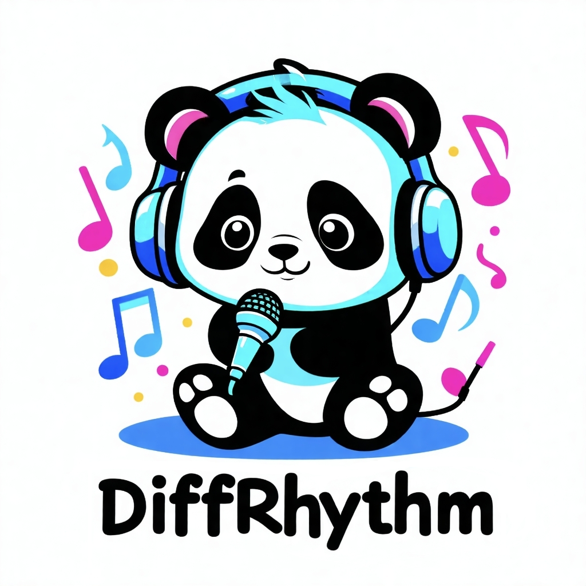
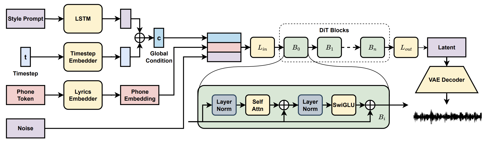

<p align="center">
    
<p>

<p align="center">
   <h1>Di♪♪Rhythm: Blazingly Fast and Embarrassingly Simple</br>End-to-End Full-Length Song Generation with Latent Diffusion</h1>
</p>

Ziqian Ning, Huakang Chen, Yuepeng Jiang, Chunbo Hao, Guobin Ma, Shuai Wang, Jixun Yao, Lei Xie†

<p align="center">
 <a href="https://huggingface.co/spaces/ASLP-lab/DiffRhythm"> Huggingface Space Demo</a> </a>&nbsp
<br>
📑 <a href="https://arxiv.org/abs/2503.01183">Paper</a> &nbsp&nbsp | &nbsp&nbsp 📑 <a href="https://aslp-lab.github.io/DiffRhythm.github.io/">Demo</a> &nbsp&nbsp | &nbsp&nbsp 💬 <a href="src/contact.md">WeChat (微信)</a>&nbsp&nbsp
</p>

DiffRhythm (Chinese: 谛韵, Dì Yùn) is the ***first*** open-sourced diffusion-based music generation model that is capable of creating full-length songs. The name combines "Diff" (referencing its diffusion architecture) with "Rhythm" (highlighting its focus on music and song creation). The Chinese name 谛韵 (Dì Yùn) phonetically mirrors "DiffRhythm", where "谛" (attentive listening) symbolizes auditory perception, and "韵" (melodic charm) represents musicality.


<p align="center">
    
<p>

## News and Updates

* 📌 Join Us on Discord! [](https://discord.gg/vUD4zgTpJa)

* **2025.3.15 🔥** **DiffRhythm-full Official Release: Complete Music Generation!**  

    The wait is over - **285s full-length music generation** is now live!  

    **Now we ask: *What if...*** 
    ```python  
    # Future experimental branches  
    model.generate(  
        duration=random.randint(95, 285),  # Dynamic length control?  
        vocals_only=True,                   # Pure acapella mode?  
        continue_existing=True              # Infinite song extension?  
    )
    ```

    *The symphony evolves. What impossible music will you compose next?*

* **2025.3.11 💻** DiffRhythm can now run on MacOS! 

* **2025.3.9 🔥** **DiffRhythm Update: Text-to-Music and Pure Music Generation!**  

    We're excited to announce two groundbreaking features now live in our open-source music model:  

    🎯 **Text-Based Style Prompts**  
    Describe styles/scenes in words (e.g., `Jazzy Nightclub Vibe`, `Pop Emotional Piano` or `Indie folk ballad, coming-of-age themes, acoustic guitar picking with harmonica interludes`) — *no audio reference needed!*  

    🎧 **Instrumental Mode**  
    Generate pure music with wild prompts like:  
    ```bash  
    "Arctic research station, theremin auroras dancing with geomagnetic storms"  
    ```

    ✨ Special Thanks to community contributor @Jourdelune for implementing these features via #PR29!

    **Full Release Notes**: See [src/update_alert.md](src/update_alert.md) for  details, demos, and roadmap.

    Break the rules. Make music that shouldn't exist.

* **2025.3.7 🔥** **DiffRhythm** is now officially licensed under the **Apache 2.0 License**! 🎉 As the first diffusion-based music generation model, DiffRhythm opens up exciting new possibilities for AI-driven creativity in music. Whether you're a researcher, developer, or music enthusiast, we invite you to explore, innovate, and build upon this foundation. 

* **2025.3.6 🔥** The local deployment guide is now available.

* **2025.3.4 🔥** We released the [DiffRhythm paper](https://arxiv.org/abs/2503.01183) and [Huggingface Space demo](https://huggingface.co/spaces/ASLP-lab/DiffRhythm).

## TODOs
- [ ] Release DiffRhythm-full.
- [ ] Support Colab.
- [ ] Support Docker.
- [ ] Release training code.
- [x] Support local deployment.
- [x] Release paper to Arxiv.
- [x] Online serving on Hugging Face Space.

## Model Versions

|  Model   | HuggingFace |
|  ----  | ----  |
| DiffRhythm-base (1m35s)  | https://huggingface.co/ASLP-lab/DiffRhythm-base |
| DiffRhythm-full (4m45s)  | Coming soon... |
| DiffRhythm-vae  | https://huggingface.co/ASLP-lab/DiffRhythm-vae |

## Inference

Following the steps below to clone the repository and install the environment.

```bash 
# clone and enter the repositry
git clone https://github.com/ASLP-lab/DiffRhythm.git
cd DiffRhythm

# install the environment

## espeak-ng
# For Debian-like distribution (e.g. Ubuntu, Mint, etc.)
sudo apt-get install espeak-ng
# For RedHat-like distribution (e.g. CentOS, Fedora, etc.) 
sudo yum install espeak-ng
# For MacOS
brew install espeak-ng
# For Windows
# Please visit https://github.com/espeak-ng/espeak-ng/releases to download .msi installer

## python environment
conda create -n diffrhythm python=3.10
conda activate diffrhythm
pip install -r requirements.txt
```

Now, you can simply use the inference script:
```bash
# For inference using a reference WAV file
bash scripts/infer_wav_ref.sh
```
or
```bash
# For inference using a text prompt reference
bash scripts/infer_prompt_ref.sh
```

Example files of lrc and reference audio can be found in `infer/example`.

You can use [the tools](https://huggingface.co/spaces/ASLP-lab/DiffRhythm) we provide on huggingface to generate the lrc

**Note that DiffRhythm-base requires a minimum of 8G of VRAM. To meet the 8G VRAM requirement, ensure `chunked=True` is set in the `decode_audio` function during inference. Higher VRAM may be required if chunked decoding is disabled.**

## Training

Coming soon...

## License & Disclaimer

DiffRhythm (code and DiT weights) is released under the [Apache License 2.0](https://www.apache.org/licenses/LICENSE-2.0). This open-source license allows you to freely use, modify, and distribute the model, as long as you include the appropriate copyright notice and disclaimer.

We do not make any profit from this model. Our goal is to provide a high-quality base model for music generation, fostering innovation in AI music and contributing to the advancement of human creativity. We hope that DiffRhythm will serve as a foundation for further research and development in the field of AI-generated music.

DiffRhythm enables the creation of original music across diverse genres, supporting applications in artistic creation, education, and entertainment. While designed for positive use cases, potential risks include unintentional copyright infringement through stylistic similarities, inappropriate blending of cultural musical elements, and misuse for generating harmful content. To ensure responsible deployment, users must implement verification mechanisms to confirm musical originality, disclose AI involvement in generated works, and obtain permissions when adapting protected styles.

## Citation
```
@article{ning2025diffrhythm,
  title={{DiffRhythm}: Blazingly Fast and Embarrassingly Simple End-to-End Full-Length Song Generation with Latent Diffusion},
  author={Ziqian, Ning and Huakang, Chen and Yuepeng, Jiang and Chunbo, Hao and Guobin, Ma and Shuai, Wang and Jixun, Yao and Lei, Xie},
  journal={arXiv preprint arXiv:2503.01183},
  year={2025}
}
```
## Contact Us

If you are interested in leaving a message to our research team, feel free to email `nzqiann@gmail.com`.
<p align="center">
    <a href="http://www.nwpu-aslp.org/">
        
    </a>
</p>
