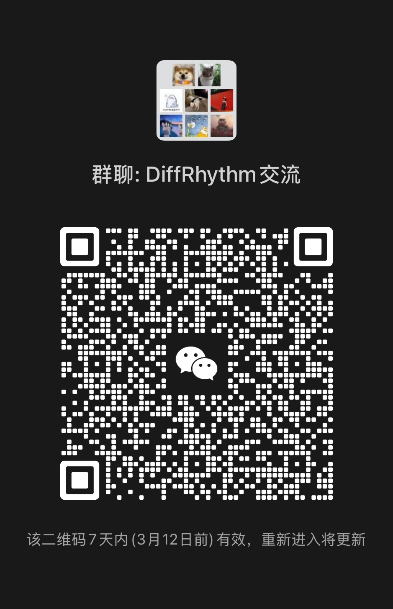

# Contact Us

### Join the Community

Due to WeChat restrictions, groups with over 200 members cannot be joined directly via QR code. 
**Please follow these steps:**  

1. **Scan the Team Member's QR Code** (below) and send a request with the note: **"DiffRhythm Group Invite"**.  
2. **Wait for Manual Invitation**: We will add you to the group within 24 hours.  

    <!-- 个人联系二维码 -->
    
     
    <em>Scan to add the team member for group invitation</em>

    
     
    <em>Group QR Code</em>

### Notes:
- If either QR code expires, please open an issue [here](https://github.com/ASLP-lab/DiffRhythm/issues), and we will refresh it promptly.
- For non-WeChat users, join our [Discord Server](https://discord.gg/vUD4zgTpJa) for discussions.
